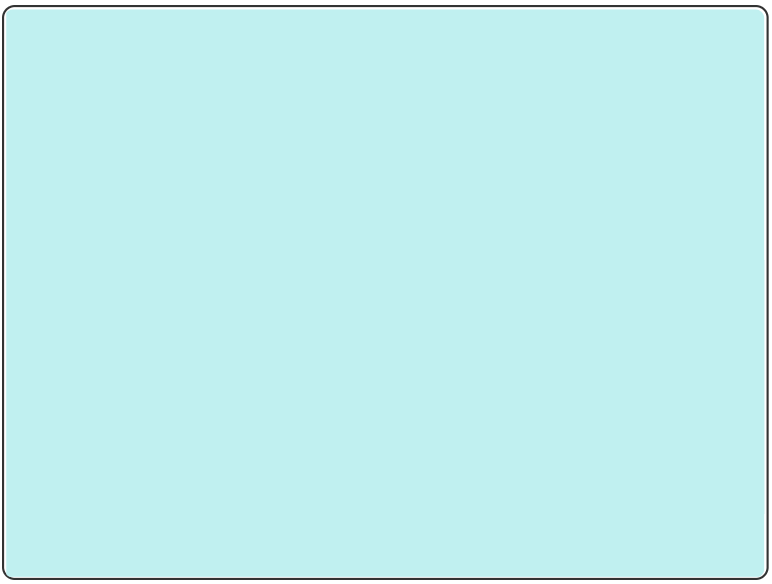

# final-project-perk2
final-project-perk2 created by GitHub Classroom
## Typography

# Heading1, 35px     
## Heading2, 30px       
#### Heading4, 16px
 

## Layout 

Page width - 1250px\
Margin-left - 8px\
Margin Right - 8px
 

## Colors

 
R-192 G- 240 B- 240 
HEX : #c0f0f0
  
    
R-69 G-129 B-155  
HEX : #40819b
  
   
R-125 G-157 B-170 
HEX : #7d9daa
  
  
R-128 G-128 B-128 
HEX : #808080
  
 
R-255 G-255 B-255 
HEX : #ffffff

## Font Families
  >Serif\
  >Monospace
